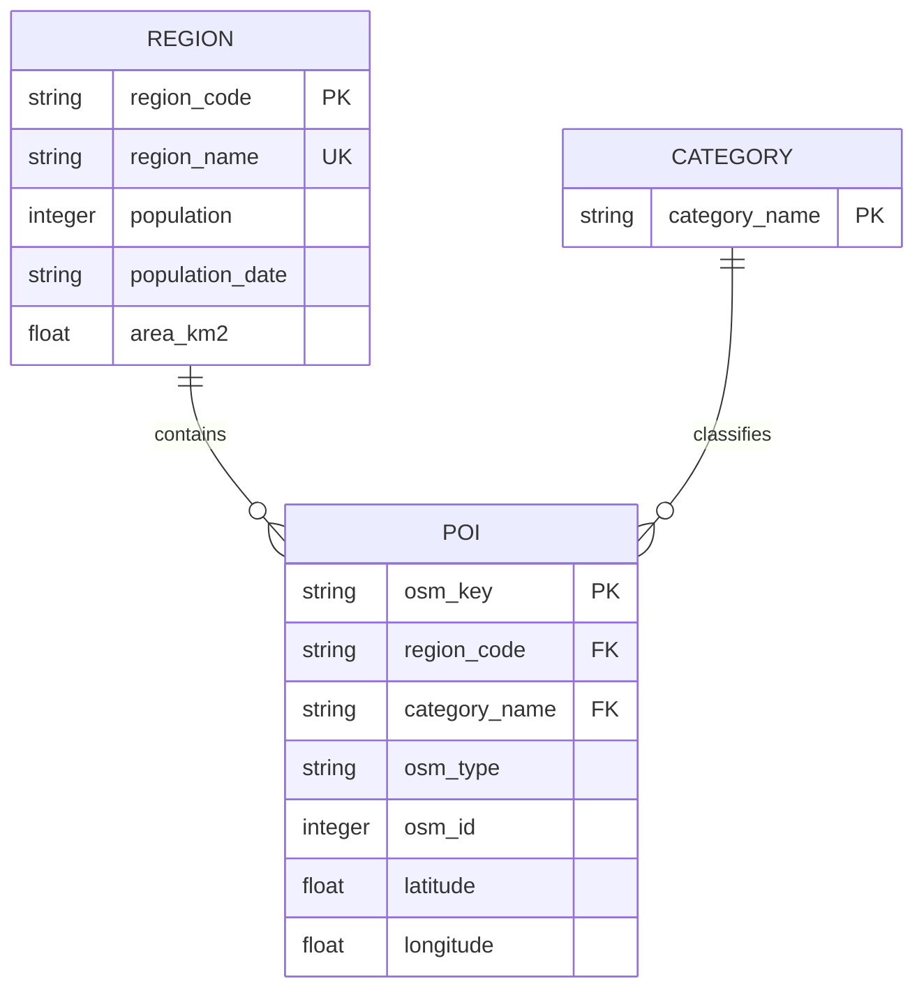

# SQLite entity relationship diagram

```mermaid
erDiagram
    REGION ||--o{ POI : contains
    CATEGORY ||--o{ POI : classifies
    REGION {
        string region_code PK
        string region_name UK
        integer population
        string population_date
        float area_km2
    }
    CATEGORY {
        string category_name PK
    }
    POI {
        string osm_key PK
        string region_code FK
        string category_name FK
        string osm_type
        integer osm_id
        float latitude
        float longitude
    }
```
